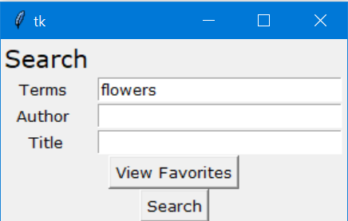
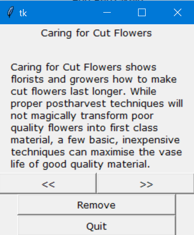
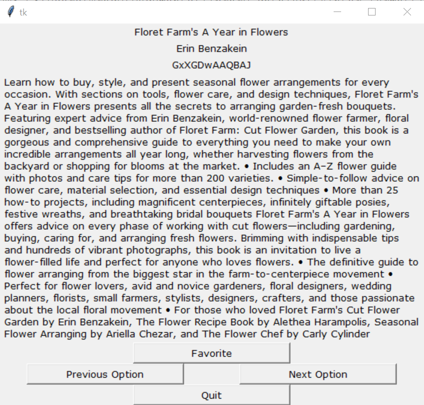

# library-catalog
Library catalog uses the Google Books API to withdraw real time, accurate information about specific book statistics (title, summary, page count, ISBN, etc.). It also uses the Tkinter library to create a basic interface in which you can browse the selection of books.

# Interface and Sample Responses
Main Interface

Favorites Interface

Search Interface

